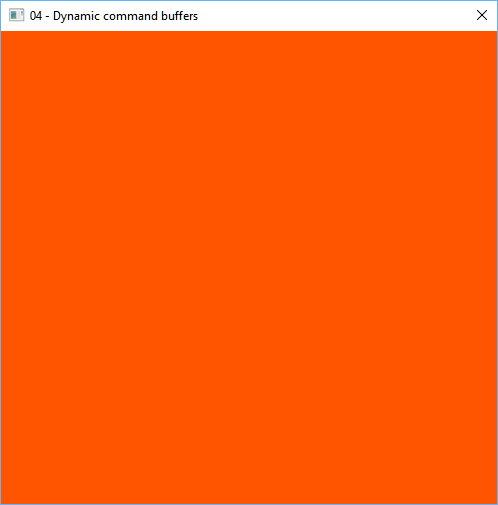

# README

Samples of using Vulkan API

This samples are written with the help of Intel tutorials, which can be found [here](https://software.intel.com/en-us/articles/api-without-secrets-introduction-to-vulkan-preface). 
The goal is better understanding on Vulkan API and writing very straightforward and plain code easy for reading.

All samples are simplified to use fixed size of window.

Thanks to Intel for very nice and easy readable tutorials!

### LICENSE

The MIT License (MIT)
Copyright (c) 2016 Alexey Gruzdev

Permission is hereby granted, free of charge, to any person obtaining a copy of this software and associated documentation files (the "Software"), to deal in the Software without restriction, including without limitation the rights to use, copy, modify, merge, publish, distribute, sublicense, and/or sell copies of the Software, and to permit persons to whom the Software is furnished to do so, subject to the following conditions:

The above copyright notice and this permission notice shall be included in all copies or substantial portions of the Software.

THE SOFTWARE IS PROVIDED "AS IS", WITHOUT WARRANTY OF ANY KIND, EXPRESS OR IMPLIED, INCLUDING BUT NOT LIMITED TO THE WARRANTIES OF MERCHANTABILITY, FITNESS FOR A PARTICULAR PURPOSE AND NONINFRINGEMENT. IN NO EVENT SHALL THE AUTHORS OR COPYRIGHT HOLDERS BE LIABLE FOR ANY CLAIM, DAMAGES OR OTHER LIABILITY, WHETHER IN AN ACTION OF CONTRACT, TORT OR OTHERWISE, ARISING FROM, OUT OF OR IN CONNECTION WITH THE SOFTWARE OR THE USE OR OTHER DEALINGS IN THE SOFTWARE.

## System requirenments

For now the project is tested only for MSVC 2015 x64 on Windows 8.1 / 10.
Cross-platform build is to be supported in (not far?) future.

For building the samples on Widows the [Lunar SDK](https://vulkan.lunarg.com/) was used.

## Graphics Samples

#### 01_Context

The shortest and simplest console application. Creates Vulckan instance and lists all physical devices found on the machine (only compatible with Vulkan)

Example:

#### 02_CommandBuffers

Another console application that makes nothing exciting. Was created to try and debug more commands like creating logical device, 
allocating command buffers and of course correct releasing of all resources

Example:

#### 03_Window

First window with Vulkan! Creates window and clears color. 
This example shows how to create swapchain, prepare simples command buffers and make correct swapchain images processing

Example:

#### 04_DynamicCommands

Uses dynamic creating of command buffers for changing window clear color.
Probably this way of creating animation is not completelly correct and effective. 
The proper way of creating dynamic commands can be found in ths sample 06_AdvancedQuad.
This sample is kept for historical reasons.

Example:

#### 05_SimpleTriangle

First geometry! Shows how to create the most simple graphics pipeline and use shaders in SPIR-V language 
In this example all verticlaes are hardcoded in vertex shaders to make the sample as simple as possible.

Example:

#### 06_AdvancedQuad

More advances rendering example. Now the geometry is passed to shaders in the proper way - through a vertex buffer.
Also there is implemened correct way of dynamic creating of command buffers.

Example:

#### 07_SimpleShading

It starts being exciting! Finally complex geonetry is drawn by Vulkan.
This sample generates mesh sphere and adjusts graphics pipeline to render indexed verticles
Shaders implement simple diffuse shading in screen space

Example:

#### 08_InteractiveCube

Renders simple cube, which can be rotated by mouse. This sample shows how to compute proper ModelView and Projection matrixes
and pass them to vertex shader as uniform buffers in runtime.

Example:

